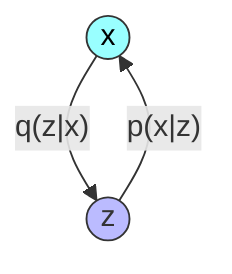

# Variational Autoencoder

## Data Set

* https://google.github.io/cartoonset/download.html

## Reference

* https://lilianweng.github.io/posts/2024-04-12-diffusion-video/
* https://arxiv.org/abs/2311.17117
* https://blog.tensorflow.org/2019/03/variational-autoencoders-with.html
* https://learnopencv.com/variational-autoencoder-in-tensorflow/
* https://tensorflow.google.cn/probability/examples/Probabilistic_Layers_VAE

## Concept


## Optimization Goal
Suppose there are `N` samples $X = (x^1, x^2, x^3, ..., x^N)$ from a data distribution. Our goal is to **maximize the likelihood** of observing this data, which is denoted as $P_\theta(X)$.


$$
\begin{align*}
\mathop{\arg\max}\limits_{\theta} \log P_\theta(X) 
&= \mathop{\arg\max}\limits_{\theta} \log \left[ P_\theta(x^1)P_\theta(x^2)P_\theta(x^3)...P_\theta(x^N) \right] \\
&= \mathop{\arg\max}\limits_{\theta} \log \prod_{i=1}^{N} P_\theta(x^i) \\
&= \mathop{\arg\max}\limits_{\theta} \sum_{i=1}^{N} \log P_\theta(x^i)  \\
\end{align*}
$$

Hence our goal is $\mathop{\arg\max}\limits_{\theta} \log P_\theta(x^i)$ , $P_\theta(x^i)$ is noted as $p(x)$ below.

Next, we involve $Q_\phi (z|x^i)$, simplified as $q(z|x)$ below




$$
\begin{align*}
\log p(x) &= \log \frac{ p(x,z) }{ p(z|x) } \\
 \log p(x) q(z|x) &= \log \frac{ p(x,z) }{ p(z|x) }  q(z|x) \\
\int\limits_{z} \log p(x) q(z|x)dz &= \int\limits_{z} \log \frac{ p(x,z) }{ p(z|x) }  q(z|x)dz \\
\log p(x) \int\limits_{z} q(z|x)dz &= \int\limits_{z} \log \frac{ p(x,z) }{ p(z|x) }  q(z|x)dz \\
\log p(x) &= \int\limits_{z} \log \frac{ p(x,z) }{ p(z|x) }  q(z|x)dz \\
\log p(x) &= \int\limits_{z} \log \frac{ \frac{p(x,z)}{q(z|x)} }{ \frac{p(z|x)}{q(z|x)} }  q(z|x)dz \\
\log p(x) &= \int\limits_{z} \left[ \log  \frac{p(x,z)}{q(z|x)} - \log \frac{p(z|x)}{q(z|x)} \right]  q(z|x)dz \\
\log p(x) &= \int\limits_{z}  \log  \frac{p(x,z)}{q(z|x)} q(z|x)dz - \int\limits_{z} \log \frac{p(z|x)}{q(z|x)} q(z|x)dz \\
\log p(x) &= \int\limits_{z}  \log  \frac{p(x,z)}{q(z|x)} q(z|x)dz + \int\limits_{z} \log \frac{q(z|x)}{p(z|x)} q(z|x)dz \\
\log p(x) &= \int\limits_{z}  \log  \frac{p(x,z)}{q(z|x)} q(z|x)dz + D_{KL} \left[q(z|x) | p(z|x) \right]  \\
\log p(x) &\ge  \underbrace{ \int\limits_{z}  \log  \frac{p(x,z)}{q(z|x)} q(z|x)dz }_{ELBO} \\
\end{align*}
$$

The objective $\mathop{\argmax}\limits_{\theta} \log p(x)$ changes to $\mathop{\argmax}\limits_{\theta,\phi} \int\limits_{z}  \log  \frac{p(x,z)}{q(z|x)} q(z|x)dz$


$$
\begin{align*}

\int\limits_{z}  \log  \frac{p(x,z)}{q(z|x)} q(z|x)dz &= \int\limits_{z}  \log  \frac{p(x|z)p(z)}{q(z|x)} q(z|x)dz \\

&= \int\limits_{z} \left[   \log  \frac{p(z)}{q(z|x)} +   \log  p(x|z) \right] q(z|x)dz \\

&= \int\limits_{z}  \log  \frac{p(z)}{q(z|x)} q(z|x)dz +  \int\limits_{z}  \log  p(x|z) q(z|x)dz \\

&= \int\limits_{z}  q(z|x)  \log p(x|z)dz - \int\limits_{z}  \log  \frac{q(z|x)}{p(z)} q(z|x)dz  \\

&= \underbrace{ \mathbb{E}_{z\sim q(z|x)} \left[\log p(x|z) \right] }_{\text{Reconstruction}} - \underbrace{D_{KL} \left[  \log  q(z|x) || p(z)  \right ]}_{\text{KL Divergence}} \\
\end{align*}
$$


The objective $\mathop{\argmax}\limits_{\theta,\phi} \int\limits_{z}  \log  \frac{p(x,z)}{q(z|x)} q(z|x)dz$ is divided into two sub-goals:

1. **Maximize the Expected Log-Likelihood:** $$\mathop{\argmax}\limits_{\theta,\phi} \mathbb{E}_{z\sim q(z|x)} \log p(x|z) $$

2. **Minimize the Kullback-Leibler Divergence:** $$\mathop{\argmin}\limits_{\theta,\phi} D_{KL} \left[  \log  q(z|x) || p(z)  \right ]$$


### Maximize the Expected Log-Likelihood

$$
\begin{align*}

\mathbb{E}_{z\sim q(z|x)} \log p(x|z) 

&= \int q(z|x)  \log p(x|z)  dz \\

& \approx \frac{1}{n} \sum_{i=1}^{n} \log p(x_i|z_i) 
&\text{Monte Carlo Approximation}
\\

&=  \frac{1}{n} \sum_{i=1}^{n} \log N(f(z_i), cI)
&{p(x_i|z_i) \sim N(f(z_i), cI)} \\

&=  \frac{1}{n} \sum_{i=1}^{n} \left[ log 
\frac{1}{ (2\pi)^\frac{D}{2} |cI|^\frac{1}{2}}
e^{ \left[
    -\frac{1}{2} (x_i - f(z_i))^T (cI)^{-1} (x_i - f(z_i))
\right]}
\right]
&\text{ Multivariate Gaussian PDF}
 \\


 &=  \frac{1}{n} \sum_{i=1}^{n} \left[
 \log 
\frac{1}{ (2\pi)^\frac{D}{2} |cI|^\frac{1}{2}}
+ \log
e^{ \left[
    -\frac{1}{2} (x_i - f(z_i))^T (cI)^{-1} (x_i - f(z_i))
\right]}

\right]
 \\


  &=  \frac{1}{n} \sum_{i=1}^{n} \left[
 \log 
\frac{1}{ (2\pi)^\frac{D}{2} |cI|^\frac{1}{2}}
    -\frac{1}{2} (x_i - f(z_i))^T (cI)^{-1} (x_i - f(z_i))
\right]
&{\because \log e^x = x}
 \\


\end{align*} 
$$

Now the subjective $\mathop{\argmax}\limits_{\theta,\phi} \mathbb{E}_{z\sim q(z|x)} \log p(x|z) $  changes to 

$$
\mathop{\argmin}\limits_{\theta,\phi}
\frac{1}{n} \sum_{i=1}^{n} \left[
 (x_i - f(z_i))^T  (x_i - f(z_i))
\right]
$$

We can deduct further

$$
\begin{align*}

\frac{1}{n} \sum_{i=1}^{n} \left[
 (x_i - f(z_i))^T  (x_i - f(z_i))
\right]

&= \frac{1}{n} \sum_{i=1}^{n} 
||x_i - f(z_i)||_2^2 
\\

&= \frac{1}{n} \sum_{i=1}^{n} 
[x_i - f(z_i)]^2 
\\

\end{align*}
$$

Hence the final optimization goal is 

$$
\mathop{\argmin}\limits_{\theta,\phi}
\frac{1}{n} \sum_{i=1}^{n} 
[x_i - f(z_i)]^2 
$$


```python
def mse_loss(y_true, y_pred):
    r_loss = K.mean(K.square(y_true - y_pred), axis = [1,2,3])
    return r_loss
```


### Minimize the Kullback-Leibler Divergence


$$
\begin{align*}

 D_{KL} \left[  \log  q(z|x) || p(z)  \right ]

&= \int  q(z|x) \log  \frac{q(z|x)}{p(z)} dz \\

&= \int  q(z|x) \log  \frac{N(\mu, \sigma^2)}{ N(0, 1)} dz  &{\because q(z|x) \sim N(\mu, \sigma^2) } \\

&= \int  q(z|x) \log  \frac{
    \frac{ 1 } { \sqrt{2\pi} \sigma} e^{ \left[ - \frac{ (z-\mu)^2 } { 2 \sigma^2} \right] }

}{ 
     \frac{ 1 } { \sqrt{2\pi} } e^{ \left[ - \frac{ z^2 } { 2 } \right] }
} dz \\


&= \int  q(z|x) \log \left( \frac{ 1 } {  \sigma}
 \frac{
     e^{ \left[ - \frac{ (z-\mu)^2 } { 2 \sigma^2} \right] }

}{ 
     e^{ \left[ - \frac{ z^2 } { 2 } \right] }
} \right) dz \\


&= \int  q(z|x) \left( \log  \frac{ 1 } {  \sigma} 

+ \log 
e^{ \left[ - \frac{ (z-\mu)^2 } { 2 \sigma^2} + \frac{ z^2 } { 2 }  \right] }
\right) dz \\


&= \int  q(z|x) \left( \log  \frac{ 1 } {  \sigma} 

- \frac{ (z-\mu)^2 } { 2 \sigma^2} + \frac{ z^2 } { 2 }  
\right) dz   &{\because \log_e e^x=x}\\


&= \frac{ 1 } { 2 } \int  q(z|x)  \left( 2\log  \frac{ 1 } {  \sigma} 

- \frac{ (z-\mu)^2 } { \sigma^2} + z^2 
\right) dz   \\


&= \frac{ 1 } { 2 } \int  q(z|x)  \left( \log  \frac{ 1 } {  \sigma ^ 2} 

- \frac{ (z-\mu)^2 } { \sigma^2} + z^2 
\right) dz  &{\because n\log x= \log x^n} \\


&= \frac{ 1 } { 2 } \int  q(z|x)  \left(   z^2 - \log \sigma ^ 2

- \frac{ (z-\mu)^2 } { \sigma^2} 
\right) dz    \\

&= \frac{ 1 } { 2 }  \left[ 
    \int  q(z|x)   z^2 dz
- \int  q(z|x) \log \sigma ^ 2 dz
- \int  q(z|x) \frac{ (z-\mu)^2 } { \sigma^2} dz  \right]   \\


&= \frac{ 1 } { 2 }  \left[ 
    \mathbb{E}_{z\sim q(z|x)} (z^2) 
- \int  q(z|x) \log \sigma ^ 2 dz
- \int  q(z|x) \frac{ (z-\mu)^2 } { \sigma^2} dz  \right]   \\


&= \frac{ 1 } { 2 }  \left[ 
    \mathbb{D}_{z\sim q(z|x)} (z) + [\mathbb{E}_{z\sim q(z|x)} (z)]^2
- \int  q(z|x) \log \sigma ^ 2 dz
- \int  q(z|x) \frac{ (z-\mu)^2 } { \sigma^2} dz  \right]  
&{\because \mathbb{D}(X) = E(X^2) - [E(X)]^2} \\


&= \frac{ 1 } { 2 }  \left[ 
   \sigma^2 + \mu^2
- \int  q(z|x) \log \sigma ^ 2 dz
- \int  q(z|x) \frac{ (z-\mu)^2 } { \sigma^2} dz  \right]  \\

&= \frac{ 1 } { 2 }  \left[ 
   \sigma^2 + \mu^2
-  \log  \sigma ^ 2 \int  q(z|x)dz
- \int  q(z|x) \frac{ (z-\mu)^2 } { \sigma^2} dz  \right]   \\


&= \frac{ 1 } { 2 }  \left[ 
   \sigma^2 + \mu^2
-  \log  \sigma ^ 2 
- \int  q(z|x) \frac{ (z-\mu)^2 } { \sigma^2} dz  \right]   \\


&= \frac{ 1 } { 2 }  \left[ 
   \sigma^2 + \mu^2
-  \log  \sigma ^ 2 
- \frac{ 1 } { \sigma^2}  \int  q(z|x) (z-\mu)^2 dz  \right]  \\

&= \frac{ 1 } { 2 }  \left[ 
   \sigma^2 + \mu^2
-  \log  \sigma ^ 2 
- \frac{ 1 } { \sigma^2}  \mathbb{E}_{z\sim q(z|x)}  (z-\mu)^2   \right]  \\

&= \frac{ 1 } { 2 }  \left[ 
   \sigma^2 + \mu^2
-  \log  \sigma ^ 2 
- \frac{ 1 } { \sigma^2}  \mathbb{E}_{z\sim q(z|x)}  (z^2 -2\mu z + \mu^2)
\right]  \\


&= \frac{ 1 } { 2 }  \left[ 
   \sigma^2 + \mu^2
-  \log  \sigma ^ 2 
- \frac{ 1 } { \sigma^2} \left[ \mathbb{E}_{z\sim q(z|x)}  (z^2) -2\mu \mathbb{E}_{z\sim q(z|x)} (z) + \mu^2) \right]
\right]  \\


&= \frac{ 1 } { 2 }  \left[ 
   \sigma^2 + \mu^2
-  \log  \sigma ^ 2 
- \frac{ 1 } { \sigma^2} \left[ \mathbb{D}_{z\sim q(z|x)} (z) + [\mathbb{E}_{z\sim q(z|x)} (z)]^2 -2\mu \mathbb{E}_{z\sim q(z|x)} (z) + \mu^2) \right]
\right]  &{\because \mathbb{D}(X) = E(X^2) - [E(X)]^2} \\


&= \frac{ 1 } { 2 }  \left[ 
   \sigma^2 + \mu^2
-  \log  \sigma ^ 2 
- \frac{ 1 } { \sigma^2} \left[ \sigma^2 + \mu^2 -2\mu \mathbb{E}_{z\sim q(z|x)} (z) + \mu^2) \right]
\right]   \\

&= \frac{ 1 } { 2 }  \left[ 
   \sigma^2 + \mu^2
-  \log  \sigma ^ 2 
- \frac{ 1 } { \sigma^2} \left[ \sigma^2 + \mu^2 -2\mu^2 + \mu^2 \right]
\right]   \\

&= \frac{ 1 } { 2 }  \left[ 
   \sigma^2 + \mu^2
-  \log  \sigma ^ 2 
- 1
\right]   \\

\end{align*}
$$


```python
def kl_loss(mean, log_var):
    kl_loss =  -0.5 * K.sum(1 + log_var - K.square(mean) - K.exp(log_var), axis = 1)
    return kl_loss
```
